# Towerbuddy backend 2.0 Local Setup

[WSL (ubuntu 20.04)/ any debian flavour of linux]


## Setting up environment

**Project Pre-requisites:** 

&nbsp;1. Supporting libraries (Linux)

``` 
sudo apt-get install -y git python3-venv python3-pip libproj-dev proj-data libgeos-dev libgdal-dev gdal-bin 

```
&nbsp;2. Postgres installation

* Install Postgres and PGadmin.

    &nbsp;   [Click here - How to install PostgreSQL on Ubuntu WSL](https://www.youtube.com/watch?v=uq-QtZ5OdRM)

  ⚠️ Tip: Remember the password you are setting, by default it will be 'postgres'

* Setting up Project
 
  &nbsp;   **Step 1:** Clone repository
  ```
  git clone https://github.com/i4sight-source/realestate-api.git
  ```

  &nbsp;   **Step 2:** Navigate to the project folder
  ```
  cd realestate-api/v1/
  ```
  &nbsp;   **Step 3:** Switch to main branch
  ```
  git checkout master-tb-2
  ```
  &nbsp;   **Step 4:** Install Dependencies

  &nbsp; Run the following commands :  
  
  ```
    # Create a virtual environment named `.venv` in the current directory 
    python3 -m venv .venv

    # Activate the virtual environment (for macOS/Linux)
    source .venv/bin/activate
 
    # Install all dependencies listed in `new_requirements.txt` using pip
    pip3 install -r new_requirements.txt
   ```

    > ⚠️ **Potential Issue: psycopg2 Installation**
    >  
    > If you encounter issues related to `psycopg2`, try the following:
    >  
    > ```bash
    > pip install psycopg2-binary
    > ```
    >  
    > After installing, try installing the requirements again:
    >  
    > ```bash
    > pip install -r requirements.txt
    > ```

## Database Setup

&nbsp; **1. Check PostgreSQL Service**

  &nbsp;   Make sure PostgreSQL is running. If it’s not running, pgAdmin won’t be able to connect.
 
  &nbsp; On Linux/macOS: Run - 
  ```
  sudo systemctl status postgresql
  ```
  &nbsp; If it's inactive: Run - 
  ```
  sudo systemctl start postgresql
  ```
&nbsp; **2. Set up the database**

  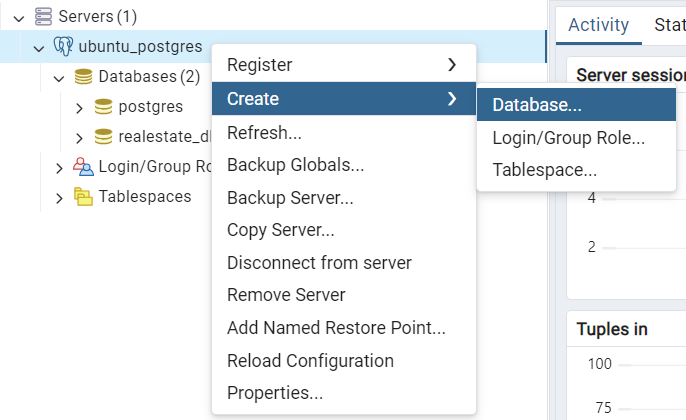

  Enter a Database Name and set an Owner (DB User), then Save.

  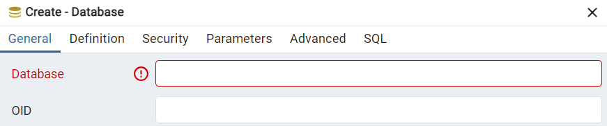

  Enable PostGIS -> Right-click on your database and select **Query Tool**.

  Run:
  ```
  CREATE EXTENSION postgis;
  ```
  &nbsp;**3. Setting Up the Environment File (.env)**

  Step 1 :  Create the .env File and run the following command in your project directory:
  ```
  touch .env
  ```
  Step 2 :  Obtain Environment Variables 

  Contact a team member to obtain the necessary environment variable values.

  Step 3 :  Configure the .env File

  Once you receive the details, update the .env file accordingly.

  &nbsp;**4. Setting Up the Core Directory**

  The following files require modifications as part of the Core directory setup:

    core/wsgi.py

    core/settings/base.py

    core/settings/dev.py

   &nbsp;**5. Running Migrations**
  
   To create and apply database migrations, run the following commands in your project directory:
   ```
   # Generate Migrations for the tenants App
   python3 manage.py makemigrations tenants

   # Generate Migrations for All Apps
   python3 manage.py makemigrations

   # Apply Migrations to the Database
   python3 manage.py migrate
   ```
   &nbsp;**6. Open Shell**
   ```
   python3 manage.py shell
   ```
   &nbsp; and paste the following : 
   ```
   from tenants.models import Client, Domain
   tenant = Client(schema_name='public', name='Public')
   tenant.save()
   domain = Domain(tenant=tenant, domain='localhost', is_primary=True)
   domain.save()
   ```
   &nbsp; Press enter and them CTRL+D to exit

   &nbsp;**7. Running Migrations for Apps**

   Run the following command to create migrations for the required apps:
   
   ```
   python3 manage.py makemigrations users realestate legal orgs reports consents
   python3 manage.py migrate
   ```
   &nbsp;**8. Creating a Tenant**
   
   Step 1 : Create a New Tenant
   ```
   python3 manage.py create_tenant
   ```
   Step 2: Configure the Tenant with the following details:

   **Schema Name**: ind
   
   **Domain**: ind.localhost
   
   ## 3. Putting data into the database

   * Get the database zip file from a team member. 

   &nbsp;  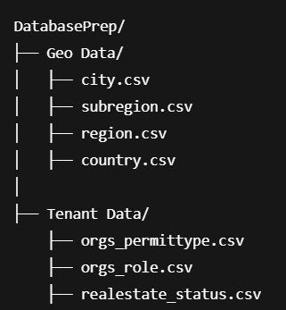

   * &nbsp;Open pgAdmin and Connect to the Database

   * &nbsp;Navigate to the Target Schema
      
   &nbsp;  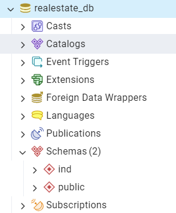

   * Tenant schema → Go to Tenant Data tables and right-click on the target table → Import/Export Data...

   &nbsp;  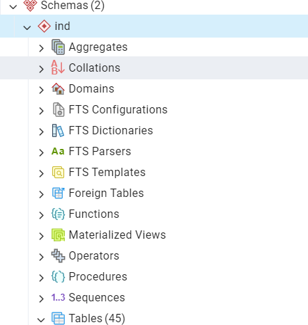
   &nbsp;  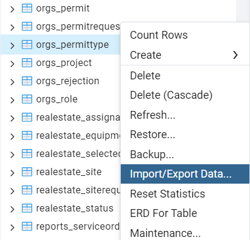
   &nbsp;  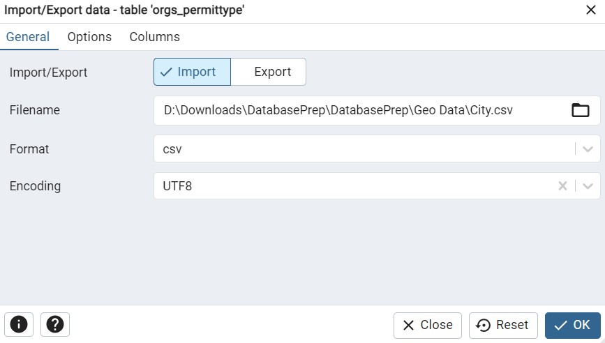

   * Public schema → Go to Geo Data tables and right-click on the target table → Import/Export Data...

   &nbsp;  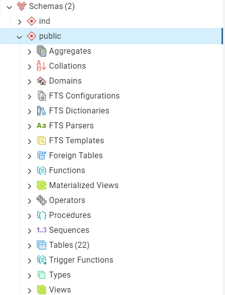
   &nbsp;  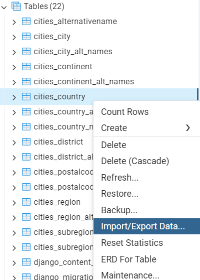
   &nbsp;  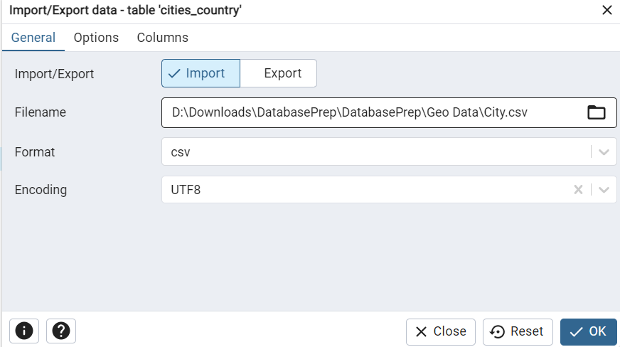
   
   * To check if data is imported correctly, do this :

   &nbsp;  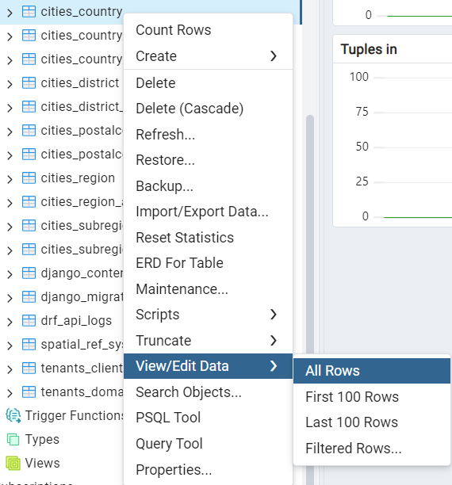
   
   &nbsp;  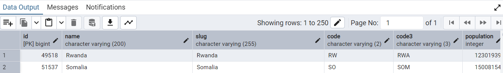
   
   

   
  

  


